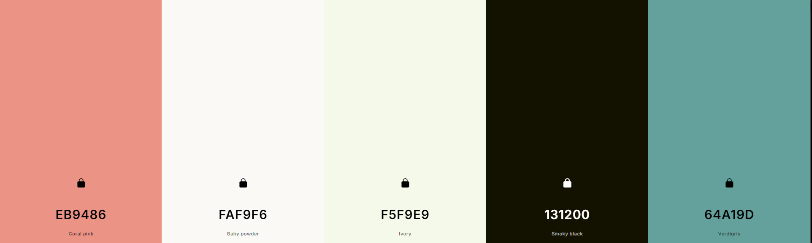
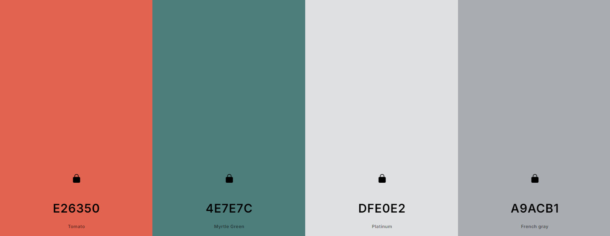
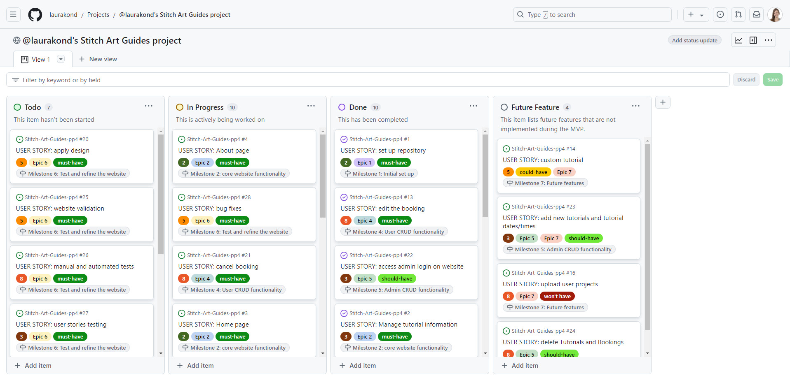
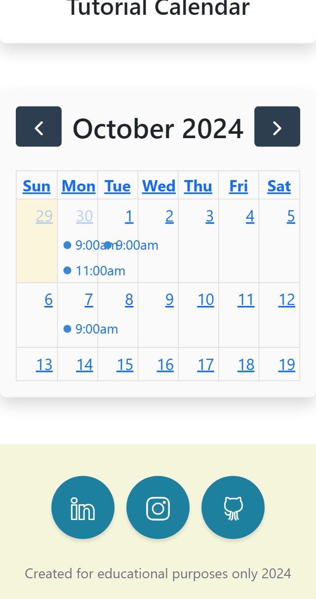
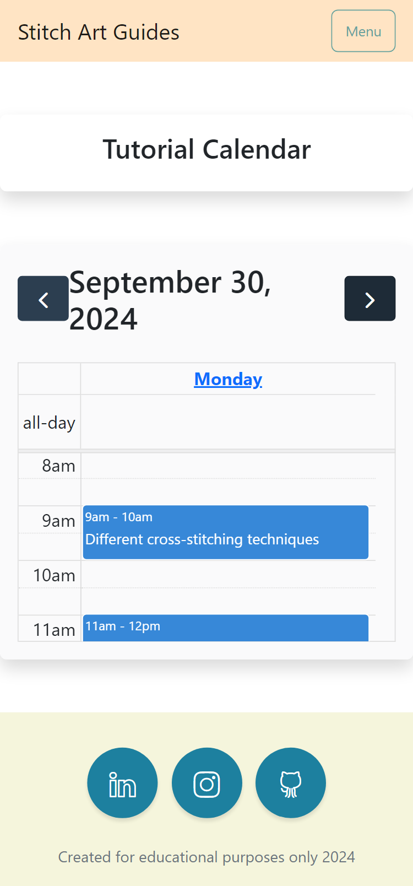

# Stitch Art Guides


(By Laura Kondrataite)

Are you practicing crafts or simply interested in dipping your toes in the vast world of modern embroidery? Then look no further. Enter the Stitch Art Guides! This website is created with avid stitchers and wondering newbies in mind. 

Art Stich Guides provides a number of various tutorials on how to set up and get started with your first project whether it is a simple cross stitch sampler or a more advanced project. 

All are welcome.

Live site can be found [here](https://stitch-art-guides-pp4-5a679feed1e1.herokuapp.com/).

## Table of Contents

[Design](#design)
- [Target Audience](#target-audience)
- [User Stories](#user-stories)
- [Flowcharts](#flowcharts)
- [Wireframes](#wireframes)
- [Color palette](#color-palette)
- [Fonts styles](#font-styles)

[Agile Methodology](#agile-methodology)
- [GitHub Project Management](#github-project-management)

[Features](#features)
- [Existing Features](#existing-features)
- [Features Left to Implement](#features-left-to-implement)

[Technologies used](#technologies-used)
- [Languages](#languages)
- [Frameworks and Libraries](#frameworks-and-libraries)
- [Databases](#databases)
- [Other Tools](#other-tools)

[Testing](#testing)

[Deployment](#deployment)
- [Github](#github)
    - [How to Fork](#how-to-fork)
    - [How to Clone](#how-to-clone)
- [Heroku](#heroku)

[Credits](#credits)
- [Content](#content)
- [Refactoring](#refactoring)
- [Used code](#used-code)
- [General resources](#general-resources)
- [Acknowledgments](#acknowledgments)
- [Code inspiration](#code-inspiration)

[Return to Table of Contents](#table-of-contents)

## Design
### Target Audience

The primary target audience for the game is:
- persons of any gender aged 16+ who enjoy crafts, 
- first time cross-stitchers,
- anyone looking for guidance on how to progress in their cross-stitch journey. 

No background, geographical location or income has been specified for the target audience. 

### User Stories

**As a developer:**
| Issue ID | User Story                                                                                                                                          |
| -------- | --------------------------------------------------------------------------------------------------------------------------------------------------- |
| [#1](https://github.com/laurakond/Stitch-Art-Guides-pp4/issues/1)        | As a developer I can set up a new workspace and a project board so that I can start working on my project.                                          |
| [#17](https://github.com/laurakond/Stitch-Art-Guides-pp4/issues/17)       | As a developer I can set up required apps and a database so that I can manage data and start building the application.                              |
| [#18](https://github.com/laurakond/Stitch-Art-Guides-pp4/issues/18)       | As a developer I can deploy the project to Heroku so that it is accessible online.                                                               |
| [#19](https://github.com/laurakond/Stitch-Art-Guides-pp4/issues/19)       | As a developer I can add a favicon so that the website renders appropriate image in the browser.                                                     |
| [#20](https://github.com/laurakond/Stitch-Art-Guides-pp4/issues/20)       | As a developer I can apply design of choice so that the website is visually appealing and represents the purpose.|
| [#25](https://github.com/laurakond/Stitch-Art-Guides-pp4/issues/25)       | As a developer, I can validate each page and app so that I know that the code adheres to best practices.                                            |
| [#26](https://github.com/laurakond/Stitch-Art-Guides-pp4/issues/26)       | As a developer, I can perform automated and manual tests so that I know all functionalities of the website are working.                             |
| [#27](https://github.com/laurakond/Stitch-Art-Guides-pp4/issues/27)       | As a developer, I can carry out user stories testing so that I know all main user criteria and MVP are met.                                         |
| [#28](https://github.com/laurakond/Stitch-Art-Guides-pp4/issues/28)       | As a developer, I can fix the bugs so that I can ensure any issues are handled before the initial project release.                                  |
| [#29](https://github.com/laurakond/Stitch-Art-Guides-pp4/issues/29)       | As a developer, I can carry out website design improvement so that I know the project adhers to the principles of UX/UI design.                      |
| [#30](https://github.com/laurakond/Stitch-Art-Guides-pp4/issues/30)       | As a developer, I can note the website progression in the README so that anyone can see the steps and actions taken for the release of the website. |
| [#31](https://github.com/laurakond/Stitch-Art-Guides-pp4/issues/31)       | As a developer I can add main website keywords and description so that the website gains higher searchability in the search engines.                 |

<br>

**As a first time user**
| Issue ID | User Story                                                                                      |
| -------- | ----------------------------------------------------------------------------------------------- |
| [#8](https://github.com/laurakond/Stitch-Art-Guides-pp4/issues/8)        | As a first time user I can create an account so that I can sign in and access members features. |

<br>

**As a site user**
| Issue ID | User Story                                                                                                                |
| -------- | ------------------------------------------------------------------------------------------------------------------------- |
| [#3](https://github.com/laurakond/Stitch-Art-Guides-pp4/issues/3)        | As a site user I can view the home page of the website so that I can understand and see the purpose of it.                |
| [#4](https://github.com/laurakond/Stitch-Art-Guides-pp4/issues/4)        | As a site user I can click on the About page so that I can read more about the website’s owner.                           |
| [#5](https://github.com/laurakond/Stitch-Art-Guides-pp4/issues/5)        | As a site user I can see the header so that I can access different pages from one place.                                  |
| [#6](https://github.com/laurakond/Stitch-Art-Guides-pp4/issues/6)        | As a site user I can see the footer so that I can access the social media and contact information.                        |
| [#7](https://github.com/laurakond/Stitch-Art-Guides-pp4/issues/7)        | As a site user I can see a list of tutorials so that I can choose which one is suitable for me.                                     |
| [#9](https://github.com/laurakond/Stitch-Art-Guides-pp4/issues/9)        | As a site user I can login to & logout of the website so that I can access and manage my content.                         |
| [#10](https://github.com/laurakond/Stitch-Art-Guides-pp4/issues/10)       | As a site user I can click on each tutorial listing so that I can read more information about the tutorial.                                  |
| [#11](https://github.com/laurakond/Stitch-Art-Guides-pp4/issues/11)       | As a site user I can book a tutorial so that I can attend it.                                                             |
| [#12](https://github.com/laurakond/Stitch-Art-Guides-pp4/issues/12)       | As a site user I can go to Tutorials page so that I can manage them.                                                    |
| [#13](https://github.com/laurakond/Stitch-Art-Guides-pp4/issues/13)       | As a site user I can edit my booking so that I can adjust the details if I change my mind.                                |
| [#14](https://github.com/laurakond/Stitch-Art-Guides-pp4/issues/14)       | As a site user I can submit a request for a customised tutorial so that I can have a lesson based on my individual needs. |
| [#15](https://github.com/laurakond/Stitch-Art-Guides-pp4/issues/15)       | As a site user I can comment on the tutorial so that I can share my feedback.                                              |
| [#16](https://github.com/laurakond/Stitch-Art-Guides-pp4/issues/16)       | As a site user I can can upload my projects so that I can share my progress.                                              |
| [#21](https://github.com/laurakond/Stitch-Art-Guides-pp4/issues/21)       | As a site user I can cancel my booking so that I can adjust the details if I change my mind.                              |

<br>

**As a site admin**
| Issue ID | User Story                                                                                                            |
| -------- | --------------------------------------------------------------------------------------------------------------------- |
| [#2](https://github.com/laurakond/Stitch-Art-Guides-pp4/issues/2)        | As a site admin I can access the admin site so that I can manage the bookings and edit tutorial information.          |
| [#22](https://github.com/laurakond/Stitch-Art-Guides-pp4/issues/22)       | As a site admin I can access the front end admin site so that I can access content available for site admin only.     |
| [#23](https://github.com/laurakond/Stitch-Art-Guides-pp4/issues/23)       | As a site admin I can create new Tutorials and tutorial dates & times so that I can offer the user different content. |
| [#24](https://github.com/laurakond/Stitch-Art-Guides-pp4/issues/24)       | As a site admin I can delete Tutorials, tutorial dates/times and bookings so that I can update the content.           |

<br>

### Flowcharts
I used [Lucidchart](https://lucid.app/) for creating the logic and structure of the game. The flowchart of the project has had to be split into two flowcharts (minimum viable product & future feature) due to limited use of blocks per one chart. Chapter 3 is a future feature. 

- MVP flowchart:


- Future feature flowchart (Chapter 3):


### Wireframes
The following wireframes show the initial idea of how the website would look on different devices: mobiles, tablets/iPads and laptops/desktops. 

[Stitch Art Guides wireframes](documentation/design/wireframes.pdf)

### Color palette
The following palette was used to ensure the contrast is achieved between main parts of the website:

<details>
    <summary>Color palette images</summary>



</details>

<br>

- #EB9486 - Coral Pink - used for main navigation button
- #FAF9F6 - Baby Powder - used for majority of the background color & light text
- #F5F9E9 - Ivory - used for header & footer backgrounds including modals
- #131200 - Smoky Black - used for dark text
- #64A19D - Verdigris - used for social media icons and menu bar
- #E26350 - Tomato - used for main button hover effect
- #4E7E7C - Myrtle Green - used for custom success button hover effect
- #DFE0E2 - Platinum - used to style past events in the calendar
- #A9ACB1 - French gray - used to style past events in the calendar
- rgba(235, 148, 134, .5) - used for the main button hover border and future events background color in the calendar
- rgba(78, 126, 124, .5) - used for the success button hover border and calendar styling
- #daeae9b8 - used for adding gradient over the hero image


### Font styles
I used [Google fonts](https://fonts.google.com/) to source the fonts for the website. These are:
- Poppins, system-ui - was used for the logo and accent text.
- Raleway, sans-serif - was used for the the main text.


[Return to Table of Contents](#table-of-contents)


## Agile Methodology

### GitHub Project Management

  

- GitHub Project board was used to manage the progress and development of this project.
- It allowed me to scope the project and keep track of progress, sometimes revising estimated dates and tasks that were needed to be done by a certain point. 


[Return to Table of Contents](#table-of-contents)


## Features
### Existing Features

**The Header**


- Featured across all the pages, the Header is fully responsive and presents the user with main pages that are required. To the left of the header you find:
    - The Logo

- To the right of the header the remainder of the pages:
    - Home Page
    - About Page
    - Tutorial List Page
    - Register Page
    - Login Page

- Upon Registration or Log in, the user's log in name and additional two pages are revealed in the header. This creates a sense of personalisation and indicates additional website functionality for the registered users.
    - Book Tutorial Page
    - My Tutorials Page


**The Footer**


- The Footer features social media links for that are related to the website and provides a copyright line indicating that this website was created for educational purposes only. 

**The Landing Page**


- The Landing page greets the user with a simple design, a brief blurb indicating the purpose of the website, and the main call to action button that leads the user to the Tutorial List page. 
- The hero image set in the background further emphasises the website's purpose.

**About page**


- The About page displays a profile picture of the instructor and provides a brief introduction. A further call to action button is used allowing the user to explore different tutorials that are being offered. 


**Tutorial list**
- A list of currently offered tutorials is presented in a card format which displays the tutorial holding image, the title and the excerpt for each tutorial. Each has a call to action button inviting the user to read more. 


**Individual Tutorial page**
- Once inside each tutorial the user is presented with a full tutorial description and the tutor name.
    -  A call to action button invites the user to either Book a tutorial if the user is logged in or Register to proceed with the booking.
    - If the user is not logged in or registered, they will be redirected to either the Login or Register pages. 
    - Upon Registration or login they are redirected to the home page.

**User authentication**

<details>
    <summary>Register</summary>

- The Register form allows the user to create an account in order to access additional content: Book Tutorial page, and My Tutorials page.
    - Upon successfull registration, a confirmation message is displayed at the top of the page and the user is redirected to the home page.
    - The user's name is also visible at the top of the navigation bar "Hi, name!".
    
    
</details>

<details>
    <summary>Login</summary>
- The Login form allows the user to access their account and manage their bookings.
    - Upon successfull login, a confirmation message is displayed at the top of the page and the user is redirected to the home page.
    - The user's name is also visible at the top of the navigation bar "Hi, name!".


</details>

 <details>
    <summary>Logout</summary>
- When the user wishes to leave the account the logout button enables a confirmation page ensuring that the user is informed of their actions.
    - Upon successfull logout, a confirmation message is displayed at the top of the page.


</details>

**Book Tutorial page**
- Once the user is Registered/Logged in, they can access Book Tutorial page that displays a calendar with available tutorial slots. 
- Upon clicking on the tutorial event, they are provided with three options:
    - If the tutorial slot is scheduled in the past, a modal appears indicating that hte tutorial time has ceased and they are prompted to select another available slot.
    - If the tutorial is already booked, a modal appears indicating that the tutorial is already booked.
    - If the tuturial is available, the user is redirected to a booking page.
- I have chosen to display the calendar as a daily view for screens smaller than 768px in order to display full tutorial title without it being cut off by the Full Calendar configurations. 
- The screens over 768px display a montly view. If the tutorial title is longer, it expands upon hovering over it. 

    

**Tutorial slot booking page**
- Once inside each tutorial slot, the user is given reinforcing information about the tutorial and a "Book tutorial" button.
    - Upon clicking the button, a modal pops up asking the user to confirm their booking.
    - Once they have booked the tutorial slot, they are redirected to My Tutorials page and a confirmation message is displayed at the top of the page. 

**My Tutorials page**
- The user can access their booked tutorial information in their My Tutorials page. There they can see past and upcoming bookings, and if they do not have any current bookings, "Discover tutorials" or "Book tutorial" buttons are displayed that would take the user to appropriate pages. 
- Each upcoming tutorial has two buttons: "Edit booking" and "Cancel booking".
    - If the user wants to delete the booking, a modal pops up asking the user to confirm the cancellation.
        - Upon successfull cancelation, a confirmation message is displayed at the top of the page and the user is redirected to My Tutorials page.
    - If the user wants to edit the booking, they are redirected to an individual page.

**Edit booking page**
- Once inside the Edit Booking page, the user is presented with a drop down form which displays four options:
    1. If there are no future tutorial slots available the "No available dates for all tutorials. Come back later to check." message is displayed above the drop down.
        - 
    2. If there are no slots available for that specific tutorial, the "No other available dates for 'tutorial title' tutorial. Feel free to choose another though!" message is displayed.
        - The drop down list generates other available tutorials that the user can choose from.
        - Upon selection, the user can click "Update booking" button.
        - If the booking is sucessful, the user is redirected to My Tutorials page, and a confirmation message is displayed at the top of the page.
        - 
    3. If there are available slots for that specific tutorial and no other tutorials, the "Choose another date for your tutorial." message is displayed.
        - The drop down list generates all available tutorial dates that the user can choose from.
        - Upon selection, the user can click "Update booking" button.
        - If the booking is sucessful, the user is redirected to My Tutorials page, and a confirmation message is displayed at the top of the page.
        - 
    4. If the same tutorial slots and other tutorial slots are available, the "Pick another date or choose a different tutorial." message is displayed.
        - The drop down list generates all available tutorial dates that the user can choose from.
        - Upon selection, the user can click "Update booking" button.
        - If the booking is sucessful, the user is redirected to My Tutorials page, and a confirmation message is displayed at the top of the page.
        - 


**Error pages**
- The following error pages have been added to troubleshoot appropriate server response to user requests:
    <details>
        **<summary>400 error page</summary>**

    
    </details>

    <details>
        **<summary>403 error page</summary>**

    
    </details>

    <details>
        **<summary>404 error page</summary>**

    
    </details>

    <details>
        **<summary>500 error page</summary>**

    
    </details>

**Notification messages**
<details>
    <summary>User registration/access</summary>


</details>

 <details>
    <summary>Tutorial booking confirmation</summary>


</details>

 <details>
    <summary>Modals</summary>


</details>

 <details>
    <summary>Confirmation messages </summary>


</details>


### Features Left to Implement
- Allow the user to submit a customised tutorial request form. This would allow to address any individual needs of a crafter.  
- Implement comment and review features for each tutorial.
- Develop an in depth user participation by providing an ability to share or sell their own craft projects. This includes allowing the user to submit their project photos, titles, author’s name, and so on.
- Filter tutorial drop down menu in the edit tutorial page in order to show just that tutorial's future dates for picking from. Currently this feature is being handled by applying different notificaitons to to the user once they enter edit booking page.
- Create a site admin front end access allowing the site administrator to create, edit and delete existing and future tutorials.
    - This would also involve notifying the users of any changes to their booked tutorials. 
- Any unresolved bug fixes and further website performance enhancements.

[Return to Table of Contents](#table-of-contents)

## Technologies used
### Languages

- Python 3.12.5: the primary language used to develop the server-side of the website.
- JavaScript: the primary language used to develop interactive components of the website and handle click events.
- HTML: the markup language used to create the website.
- CSS: the styling language used to style the website.
- Markdown: the markup language to create the README and TESTING files.

### Frameworks and Libraries
- [Django](https://www.djangoproject.com/) Python framework for the overall project logic implementation.
- [Bootstrap](https://getbootstrap.com/) CSS framework that allowed to implement various styled elements, including modals. It was also used for quick and easy styling of the overall website.
- [Full Calendar](https://fullcalendar.io/) JavaScript calendar open source that allowed to display available tutorial bookings in a calendar view. 

### Databases
- PostgreSQL: the database used to store all the data.

### Other tools
- [Whitenoise](https://whitenoise.readthedocs.io/en/stable/index.html) was Python library used for handling static files.
- [Django allauth](https://allauth.org/) authentication library was used for allowing users to register and login.
- [Django crispy forms](https://django-crispy-forms.readthedocs.io/en/latest/) was used for allowing to render user POST requests.
- [Django summernote](https://summernote.org/) was used for providing useful editing tools for Django admin site. 
- [GitHub](https://github.com/) was used for creating and storing files and folders of the website.
- [Heroku](https://www.heroku.com) was used for accessing and storing my application game.
- **Git** was used for version control.
- **Pip** was used to install required dependencies.
- **VScode** editor was used for writing the code.
- **Gunicorn** webserver used to run the website.
- [CI Python Linter](https://pep8ci.herokuapp.com/#) was used for validating and checking my code for best code practices.
- [JS Hint](https://jshint.com/) was used for validating Javascript code.
- [W3C Markdown](https://validator.w3.org/) was used for validating html files.
- [W3C CSS](https://jigsaw.w3.org/css-validator/) was used for validating css files.
- [Lucidchart](https://lucid.app/) was used for creating the website flowcharts.
- [Balsamiq](https://balsamiq.com/) used for creating wireframes.
- [Google Fonts](https://fonts.google.com/) for choosing appropriate fonts
- [Favicon](https://favicon.io/) for generating a favicon
- Google Chrome DevTools for testing, troubleshooting and brainstorming code solutions
- [Am I Responsive?](https://ui.dev/amiresponsive) website for showing the website's responsiveness on different devices
- [Responsive Design Checker](https://responsivedesignchecker.com/) website for checking responsiveness on different devices
- [Pixelied](https://pixelied.com/) and Gimp, for resizing, compressing and editing images
- [Coolors](https://coolors.co/) for generating the color palette
- WCAG color contrast checker for website accessibilty
- Wave evaluation tool for giving visual feedback about the accessibility of the website
- [Contrast Grid](https://contrast-grid.eightshapes.com/) to test chosen color palette

Full list of dependencies used for the project can be found in the requirements.txt file. 

 [Return to Table of Contents](#table-of-contents)

## Testing

The game application went through extensive testing during the development and deployement stages. 
- See [TESTING.md](TESTING.md) file for full testing and validation information.

[Return to Table of Contents](#table-of-contents)


## Deployment
This website was deployed using GitHub pages and Heroku website. To deploy the project, follow the steps below:

### Github
1. Login to GitHub and navigate to the main repository page.
2.  Click on the chosen repository [repository-name]().
3. Once inside the repository, click on the "Settings" tab above the repository title displayed around the middle of the page.
4. Select "Pages" tab on the left side navigation menu.
5. In the "Source" section (middle of the screen), select "main" or "master" branch, then "root" folder and click "save" button.
6. The GitHub page site will be deployed.

It might take a few minutes to generate the "live" website link.

The live link to the website [Stitch Art Guides](https://stitch-art-guides-pp4-5a679feed1e1.herokuapp.com/).

#### How to Fork
To fork the repository in Github:
1. Follow steps 1 & 2 as above. 
2. Once inside the chosen repository, click the "fork" button in the top right corner above the "About section".

#### How to Clone
To clone the repository in Github:
1.  Follow steps 1 & 2 as in the deployment section above.
2.  Click on the "Code" button (often a bright color that stands out) in the top right corner just above the "commits" history. 
    - Select whether you would like to clone with HTTPS, SSH or GitHub CLI and copy the link shown.
3.  Open the terminal in your chosen code editor and change the current working directory to the location you want to use for the cloned directory.
4.  Type 'git clone' into the terminal and then paste the copied link and press enter.

### Heroku
To deploy to the Heroku website, follow the steps below:
1. Navigate to https://www.heroku.com platform website.
2. Create or log in to your account.
3. Once on your dashboard:
    1) if you don't have any projects created yet, there should be a "Create a new app" prompt in the middle of the screen.
    2) if you have some projects already, click on the "New" tab on the top right corner of the screen just below the profile bauble. 
4.  Enter a unique application name for your project and select the region you are based in. Click "create app".
5. Once insde the app, select "Settings" button from the menu in the middle. It's important to edit the "Settings" tab before deploying the project: 
    1. Click on "Reveal Config Vars" and enter the following:
        
        1) if you are using any APIs you will need to copy paste your creds.json details:
            - in the "key" box type "CREDS". 
            - in the "value" box copy the contents of your creds.json file: 
            - click "Add".

        2) type in PORT to the "key" box, and 8000 to the "value" box:
            - click "Add".

    2. Add Buildpacks below Config Vars. Click on "Add buildpack":

        1) First, select Python and click "Add buildpack".
        2) Second, select node.js and click "Add buildpack".
        
        **Note:** Python has to be listed first (at the top) of the two packs.
6. Once step 5 is done, navigate to the "Deploy" tab a the top of the screen to the left of where the Settings tab is located.
7. Click on "Github" icon under "Deployment method", and connect Heroku to your Github account. 
8. Once the accounts are connected you can choose between automatic or manual deployment:

    1) Automatic deplyoment will automatically update your app once you use "git push" command in  your IDE. 

    2) Manual deployment will require you to manually "push" the changes you made in the IDE to the Heroku system.

[Return to Table of Contents](#table-of-contents)

## Credits

### Content

### Refactoring

### Used code
- I used the following Bootstrap templates from StartBootstrap for styling my website:
    - Footer: [Stylish portfolio](https://startbootstrap.com/theme/stylish-portfolio)
    - Header: [Grayscale](https://startbootstrap.com/theme/grayscale) and Code Institute's I blog walkthrough project
    - Notification messages: Code Institute's I blog walkthrough project

- To render the different calendar view based on the screen sizes, I had to specify device sizes and apply windowResize from the Full Calendar. I used the following [Stackoverflow thread](https://stackoverflow.com/questions/73820957/fullcalendar-change-calendar-view-based-on-screen-size) to implement the code:
    ```
    $(document).ready(function () {
    let FC = FullCalendar.Calendar({
        defaultView: $(window).width() < 765 ? 'basicDay':'agendaWeek',
        windowResize: (arg) => { FC.changeView($(window).width() < 765 ? 'basicDay':'agendaWeek') },
    });
    $('#calendar') = FC;
    });
    ```

     <details>
    <summary>Calendar view images</summary>

    
    
</details>

- To make the tutorial titles become visible in the calendar month view, I used Bootstrap tooltip plugin and Full Calendar's code to implement the functionality. The below code is taken from [Codepen](https://codepen.io/pen?&editors=001)
    ```
    eventDidMount: function(info) {
      var tooltip = new Bootstrap.Tooltip(info.el, {
        title: info.event.extendedProps.description,
        placement: 'top',
        trigger: 'hover',
        container: 'body'
      });
    },
    ```
    - I found the following resources useful and informative:
    <details>
    <summary>Tooltip resources</summary>

    - [Full Calendar event display](https://fullcalendar.io/docs/event-display)
    - [Full Calendar css customization](https://fullcalendar.io/docs/css-customization)
    - [Bootstrap tooltips](https://getbootstrap.com/docs/5.0/components/tooltips/)
</details>

### General resources:
Whilst working on this project I relied on Django documentation and other resources to deepen my knowledge and gain a better understanding how to build a full-stack website. 

<details>
<summary>ERD & flowcharts</summary>

- [Lucid flowcharts Youtube video](https://www.youtube.com/watch?v=hktyW5Lp0Vo)
- [Lucid Software database tutorial for beginners](https://www.youtube.com/watch?v=wR0jg0eQsZA)
- [Decomplexify](https://www.youtube.com/watch?v=GFQaEYEc8_8)
- [Decomplexify Learn Database normalisation Youtube video](https://www.youtube.com/watch?v=GFQaEYEc8_8)
</details>

<details>
<summary>Models</summary>

- [Geeks for Geeks: Django models](https://www.geeksforgeeks.org/django-models/)
- [MDN web docs: Using models](https://developer.mozilla.org/en-US/docs/Learn/Server-side/Django/Models) 
- [W3Schools Django update model](https://www.w3schools.com/django/django_update_model.php)
- [Django forum - how do I load multiple models items into a single view](https://forum.djangoproject.com/t/how-do-i-load-multiple-models-items-into-a-single-view/919/2)
- [Best method to store alt tags in Django](https://stackoverflow.com/questions/65415221/best-method-to-store-alt-tags-in-django)
- [Verbose field names](https://docs.djangoproject.com/en/5.1/topics/db/models/#verbose-field-names)
</details>

<details>
<summary>User flows:</summary>

- [Figma user flow kit](https://www.figma.com/community/file/830510773896272856/user-flow-kit)
- [Creatly common mistales to avoid when creating user flow diagrams](https://creately.com/guides/user-flow-diagram/#common-mistakes-to-avoid-when-creating-user-flow-diagrams)
</details>

<details>
<summary>Restricting authorised access:</summary>

- The following chat threads on Stackoverflow were very useful when trying to determine which login restrictions to use for defensive programming:
    - [@login_required and is_authenticated() -- When to use which in Django?](https://stackoverflow.com/questions/22488601/login-required-and-is-authenticated-when-to-use-which-in-django#:~:text=login_required%20is%20applied%20on%20a,is%20logged%20in%20or%20not)
    - [Using the Django authentication system](https://docs.djangoproject.com/en/5.1/topics/auth/default/) was also really helpful for determining what aspects were useful for restricting access. 
</details>

<details>
<summary>Implementing calendar view for tutorial display:</summary>

- [Real Python: The Python calendar module](https://realpython.com/python-calendar-module/)
- [Python documentation: calendar](https://docs.python.org/3/library/calendar.html)
- [Geeks for Geeks Python calendar module](https://www.geeksforgeeks.org/python-calendar-module/)
- [Codemy Django Wednesdays Youtube tutorial](https://www.youtube.com/watch?v=4EJlrweJE-M)
</details>

<details>
<summary>Python datetime:</summary>

-  [Python documentation datetime - basic date and time](https://docs.python.org/3/library/datetime.html#format-codes)
- [Geeks for Geeks Isoformat() method](https://www.geeksforgeeks.org/isoformat-method-of-datetime-class-in-python/)
- [Python strftime cheatsheet](https://strftime.org/)
- [Django docs querysets](https://docs.djangoproject.com/en/5.1/ref/models/querysets/#icontains)
- [Function of pub_date__gte=datetime.now](https://stackoverflow.com/questions/18706979/function-of-pub-date-gte-datetime-now)
</details>

<details>
<summary>Creating Django error pages:</summary>

- [Geek for geeks: Django creating a 404 error page](https://www.geeksforgeeks.org/django-creating-a-404-error-page/?ref=oin_asr1)
- [Geeks for geeks: handling custom error page](https://www.geeksforgeeks.org/python-django-handling-custom-error-page/)
</details>

<details>
<summary>Queryset.exists():</summary>

- [Dev community: queryset.exists() more efficient than queryset.count()](https://dev.to/codereviewdoctor/why-queryset-exists-is-more-efficient-than-queryset-count-2f3h)
- [Django documentation: check if record exists in model](https://forum.djangoproject.com/t/check-if-record-exists-in-model/10712/5)
- [Reddit: Checking a place is already booked or not based on time](https://www.reddit.com/r/django/comments/1bb6zin/checking_a_place_is_already_booked_or_not_based/)
</details>

<details>
<summary>I used the following resources to familiarise myself with how to center a div:</summary>

- [How to center a div](https://www.geeksforgeeks.org/how-to-center-a-div-with-the-mx-auto-class-in-bootstrap-5/)
- [A Designer who codes - three ways to center content](https://www.youtube.com/watch?v=nx8jyWLy0e0)
- [Geek for Geeks: how to set a vertical alignment in Bootstrap](https://www.geeksforgeeks.org/how-to-set-vertical-alignment-in-bootstrap/) Youtube tutorial
- [How to vertical align a div in Bootstrap](https://www.tutorialrepublic.com/faq/how-to-vertical-align-a-div-in-bootstrap.php)
- [StackOverflow: centering elements vertically and horizontally](https://stackoverflow.com/questions/42388989/bootstrap-centering-elements-vertically-and-horizontally) 
- [StackOverflow: how to align header in top footer](https://stackoverflow.com/questions/76053250/how-align-header-in-top-footer-in-bottom-of-the-page-and-main-between-them-in-b)
</details>

<details>
<summary>Securing Django views from unauthorised access:</summary>

- [Daisy McGirr's article](https://www.codu.co/articles/securing-django-views-from-unauthorized-access-npyb3to_)
- [Allauth templates](https://docs.allauth.org/en/latest/common/templates.html)
</details>

<details>
<summary>Creating event bookings:</summary>

- [Geek for Geeks: model objects create](https://www.geeksforgeeks.org/understanding-django-model-vs-modelobjectscreate/)
- [Stackoverflow: django model vs model objects create](https://stackoverflow.com/questions/26672077/django-model-vs-model-objects-create)
- [Stackoverflow: difference beween object create and object save](https://stackoverflow.com/questions/23926385/difference-between-objects-create-and-object-save-in-django-orm#:~:text=save()%20perform%20internally%20as,only%20INSERT%20object%20to%20db.&text=INSERT%20%E2%86%92%20If%20the%20object's,t%20exist%20in%20the%20database)
- [Reddit: how to handle a post request without a form](https://www.reddit.com/r/django/comments/qadv5m/how_to_handle_a_post_request_without_a_form/)
</details>

<details>
<summary>Disable clickdate:</summary>

- [Stackoverflow: disable past date in Full Calendar](https://stackoverflow.com/questions/72622009/disable-past-date-in-fullcalendar-for-dateclick)
- [MDM Web docs: date setHours()](https://developer.mozilla.org/en-US/docs/Web/JavaScript/Reference/Global_Objects/Date/setHours)
- [Full Calendar: dateclick](https://fullcalendar.io/docs/dateClick)
</details>

<details>
<summary>Comparing event date to current date & redirecting/alerting the user to appropriate page:</summary>

- [Pyhton documentation: datetime](https://docs.python.org/3/library/datetime.html)
- [StackOverflow: easiest way to combine date and time strings](https://stackoverflow.com/questions/9578906/easiest-way-to-combine-date-and-time-strings-to-single-datetime-object-using-pyt)
- [Stackoverflow: how can I check if date is passed from Django model](https://stackoverflow.com/questions/73260028/how-can-i-check-if-date-is-passed-from-django-model)
</details>

<details>
<summary>Forms & filtering the form to fetch future tutorials:</summary>

- Django documentation including [form fields](https://docs.djangoproject.com/en/dev/ref/forms/fields/#modelchoicefield) 
- [Stackoverflow: filter foreing key choices](https://stackoverflow.com/questions/291945/how-do-i-filter-foreignkey-choices-in-a-django-modelform/291968#291968)
- [Django project forum](https://forum.djangoproject.com/t/queryset-difference/15716)
- [Stackoverflow: modelform with conditions](https://stackoverflow.com/questions/43001425/django-modelform-with-conditions)
- [Stackoverflow: super().__init__(**kwargs)](https://stackoverflow.com/questions/50550153/calling-super-init-kwargs-and-multiple-inheritance)
- [Stackoverflow def __init__(self, *args, **kwargs) initialization of class in python](https://stackoverflow.com/questions/23027846/def-init-self-args-kwargs-initialization-of-class-in-python)
- [exclude() method](https://docs.djangoproject.com/en/5.1/ref/models/querysets/#:~:text=exclude()%20%C2%B6&text=Returns%20a%20new%20QuerySet%20containing%20objects%20that%20do%20not%20match,enclosed%20in%20a%20NOT()%20)
- [Queryset filter not equal](https://sentry.io/answers/django-queryset-filter-not-equal/#:~:text=The%20exclude()%20method%20from,excluded%20from%20the%20returned%20QuerySet)
- [Queryset difference](https://forum.djangoproject.com/t/queryset-difference/15716)
- [Calling super().__init__(**kwargs), and multiple inheritance?](https://stackoverflow.com/questions/50550153/calling-super-init-kwargs-and-multiple-inheritance)
- [request.user in Django Form](https://stackoverflow.com/questions/8357607/request-user-in-django-form)
- [Django ModelForms __init__ kwargs create and update](https://stackoverflow.com/questions/21119494/django-modelforms-init-kwargs-create-and-update)
- [Stackoverflow: form date input](https://stackoverflow.com/questions/61076688/django-form-dateinput-with-widget-in-update-loosing-the-initial-value)
- [datefield setting default date](https://forum.djangoproject.com/t/datefield-setting-default-date/28029)
- [show dd-mm-yy in input type date field](https://forum.djangoproject.com/t/show-dd-mm-yy-in-input-type-date-field/31765)
- [Real Python social forms](https://realpython.com/django-social-forms-4/)
- [Geeks for Geeks Django forms](https://www.geeksforgeeks.org/django-forms/)
- [Django form, request.post and initial](https://stackoverflow.com/questions/8994619/django-form-request-post-and-initial)
- [Django form __init__() got multiple values for keyword argument](https://stackoverflow.com/questions/14322185/django-form-init-got-multiple-values-for-keyword-argument)
- [Passing **kwargs to Django Form](https://stackoverflow.com/questions/1993014/passing-kwargs-to-django-form)
- [Using request.user in Forms.py](https://forum.djangoproject.com/t/using-request-user-in-forms-py/19184/5)
- [django custom form - removing fields based on user](https://forum.djangoproject.com/t/django-custom-form-removing-fields-based-on-user/4291)
- [request.user in Django Form](https://stackoverflow.com/questions/8357607/request-user-in-django-form)
- [Django : ModelForm with conditions](https://stackoverflow.com/questions/43001425/django-modelform-with-conditions)
- [Filtering choices in a form based on previous field selection - Django](https://stackoverflow.com/questions/55572315/filtering-choices-in-a-form-based-on-previous-field-selection-django)
- [Django ModelChoiceField: filtering query set and setting default value as an object](https://stackoverflow.com/questions/5329586/django-modelchoicefield-filtering-query-set-and-setting-default-value-as-an-obj/5329761#5329761)
- [How do I filter values in a Django form using ModelForm?](https://stackoverflow.com/questions/3010489/how-do-i-filter-values-in-a-django-form-using-modelform)
</details>

<details>
<summary>is_null property:</summary>

- [Filter for empty or null values](https://www.atlassian.com/data/databases/how-to-filter-for-empty-or-null-values-in-a-django-queryset)
- [How to filter for not exists](https://stackoverflow.com/questions/14831327/in-a-django-queryset-how-to-filter-for-not-exists-in-a-many-to-one-relationsh)
- [Filter empty or null names](https://sentry.io/answers/how-do-you-filter-empty-or-null-names-in-a-queryset/)
- [What is exclude in Django](https://djangowebdevelopers.quora.com/What-is-exclude-in-Django#:~:text=Exclude())
</details>

<details>
<summary>Website design and layout:</summary>

- [Bootstrap 5 documentation](https://getbootstrap.com/docs/5.0)
- [Geek for Geeks Bootstrap card sizing](https://www.geeksforgeeks.org/bootstrap-5-cards-sizing/)
- [Stackoverflow Bootstrap cards height](https://stackoverflow.com/questions/35868756/how-to-make-bootstrap-cards-the-same-height-in-card-columns)
- [Geek for Geeks responsive divs](https://www.geeksforgeeks.org/how-to-create-responsive-divs-in-bootstrap/)
- [mdn web docs linear gradient](https://developer.mozilla.org/en-US/docs/Web/CSS/gradient/linear-gradient)
- [mdn web docs calc()](https://developer.mozilla.org/en-US/docs/Web/CSS/calc)
- [Geek for Geeks How to Center a Div](https://www.geeksforgeeks.org/how-to-center-a-div-with-the-mx-auto-class-in-bootstrap-5/)
- [Stackoverflow Bootstrap: Centering Elements Vertically and Horizontally](https://stackoverflow.com/questions/42388989/bootstrap-centering-elements-vertically-and-horizontally)
</details>

<details>
<summary>Window innerwidth property:</summary>

- [mdn web docs Window: innerWidth property](https://developer.mozilla.org/en-US/docs/Web/API/Window/innerWidth)
- [FullCalendar - Change View for Mobile Devices](https://stackoverflow.com/questions/41908295/fullcalendar-change-view-for-mobile-devices)
- [Usage of eventMouseEnter in V4 of fullcalendar](https://stackoverflow.com/questions/56472588/usage-of-eventmouseenter-in-v4-of-fullcalendar)
- [See the full content on hover over in fullcalendar3](https://stackoverflow.com/questions/70269140/see-the-full-content-on-hover-over-in-fullcalendar3)
</details>

<details>
<summary>Bootstrap Tooltip customisation:</summary>

- [Stackoverflow arrow on bootstrap](https://stackoverflow.com/questions/15383440/styling-the-arrow-on-bootstrap-tooltips#:~:text=For%20styling%20each%20directional%20arrows,and%20then%20style%20them%20individually.)
    - [JS fiddle code](https://jsfiddle.net/nvishnu/rc8kncjn/33/)
- [Stackoverflow changing bootstrap tooltip styles](https://stackoverflow.com/questions/65016703/changing-bootstrap-tooltip-styles-using-css)
- [Changing Bootstrap tooltip styles using CSS](https://stackoverflow.com/questions/65016703/changing-bootstrap-tooltip-styles-using-css)
- [Using Bootstrap 5 to create custom tooltips](https://stackoverflow.com/questions/66236686/using-bootstrap-5-to-create-custom-tooltips)
- [Tooltips not working in fullcalendar when i use bootstrap css](https://stackoverflow.com/questions/56866108/tooltips-not-working-in-fullcalendar-when-i-use-bootstrap-css)
</details>

<details>
<summary>Creating Django error pages:</summary>


</details>

### Acknowledgments

My thanks go to: 
- My mentors: 
    - [Martina Terlevic](https://github.com/SephTheOverwitch) for helping to come up with initial project idea, giving suggestions for troubleshooting, and providing reassurance when my confidence stumbled (which has happened many a time).
    - [Iuliia Konovalova](https://github.com/IuliiaKonovalova) for helping to find a solution on how to implement parts of CRUD functionality and further advice on project development.
- My fellow student, [Vernell Clark](https://github.com/VCGithubCode), for troubleshooting problematic parts of code and providing a shoulder to cry on when things got really rough.
- [Tim Nelson](https://github.com/TravelTimN) for the advice on the intricacies of JavaScript Full Calendar & general advice.
- Another fellow student, [Declan](https://github.com/Declan444), for helping to understand models and overall morale boost when it was needed.
- Tutor support team for helping out with project set up and other quirky bits. A big shout out goes to:
    - John for assisting to address Gunicorn and pyca/cryptography warnings on Github [more details noted in fixed bugs section in TESTING.md](TESTING.md). 
    - Holly for providing guidance and advice on Whitenoise and staticfiles inner workings.
    - Sarah for helping to troubleshoot delete part of CRUD functionality and find a way how to navigate tutorial editing.
    - Thomas for giving an idea of how to implement CRUD. 

### Code Inspiration
- The project was inspired and based on some parts of Code Institute's I think therefore I blog walkthrough project. 
    -  Credits are also noted within the code.
- The calendar display and website layout were inspired by United Events team's [project](https://github.com/hannahro15/July24Hackathon-United-Events) that featured in Code Institute's July hackathon.
- The layout and ideas for the website design came from Prideful programmers [project](https://github.com/VCGithubCode/prideful-programmers), which featured in Code Institute's July 2024 Hackathon.


[Return to Table of Contents](#table-of-contents)