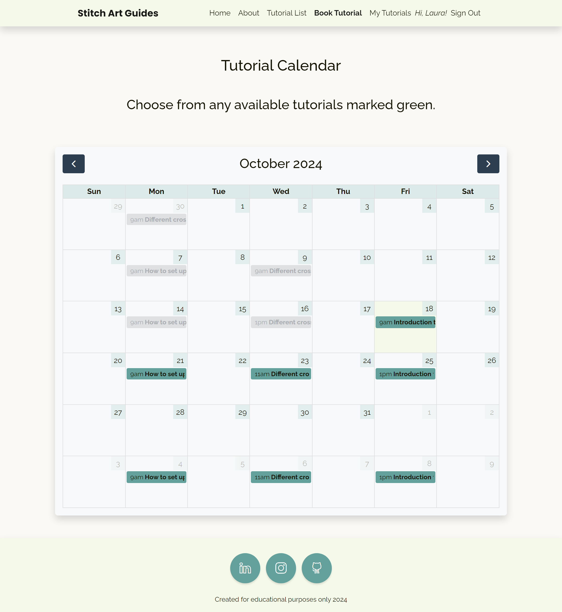
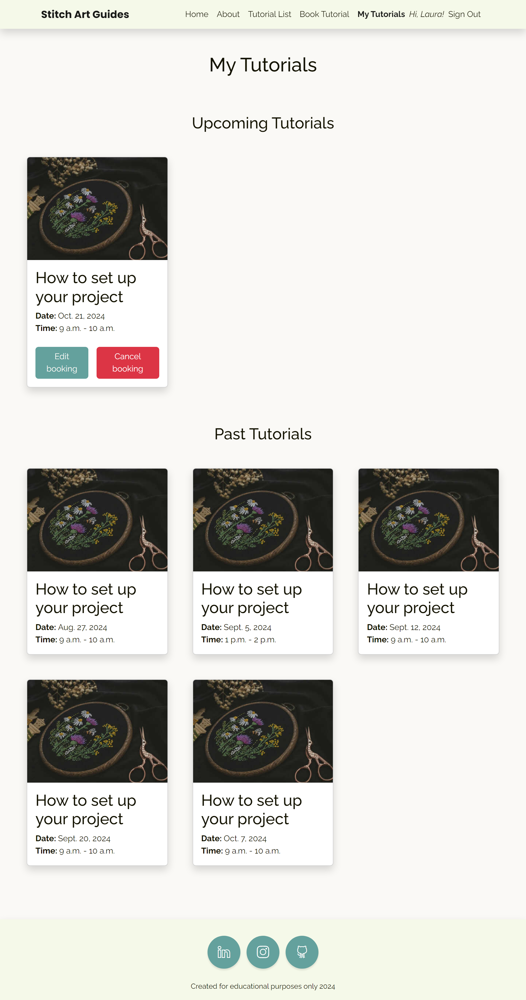

# Testing for Once Upon a Time 
By Laura Kondrataite

## Contents

[Testing](#testing)

- [W3C Validator testing](#w3c-validator-testing)
- [JS Hint testing](#js-hint-testing)
- [PEP8 Linter validation](#pep8-linter-validation)
- [Bugs](#bugs)
	- [Fixed bugs](#fixed-bugs)
	- [Unfixed bugs](#unfixed-bugs)
- [Lighthouse](#lighthouse-testing)
- [User stories testing](#user-stories-testing)
- [Accessibility](#accessibility)
- [Device testing](#device-testing)
- [User testing](#user-testing)
- [Manual testing](#manual-testing)
- [Restricted access testing](#restricted-access-testing)
- [Automated testing](#automated-testing)

## Testing

### W3C Validator Testing
All files were put through the official [W3C Markup Validation](https://validator.w3.org/) & [W3C Css Validation](https://jigsaw.w3.org/css-validator/) services. The initial check returned a few errors and warnings that were corrected and taken note of. Images of errors are enclosed below.

<details>
    <summary>W3C Markup errors</summary>

- Book a tutorial calendar template:
    - a warning of lacking headings for the section element. I replaced the section elements to the div elements.
    - an error of duplicate IDs in the modals.
    - [Book tutorial validation errors](documentation/validation/errors/book-tutorial-errors.jpg)
- My Tutorials template: 
    - a warning about an empty h2 element.
    - [My tutorials validation errors](documentation/validation/errors/my-tutorials-error.jpg)
- Edit booking template:
    - Bad value for action attribute in the form element.
    - [Edit booking validation errors](documentation/validation/errors/edit-booking-error.jpg)
- Signup template:
    - Errors using the {{form_asp}} format. I fixed it by applying crispy forms tag to the page.
    - [Signup validation errors](documentation/validation/errors/signup-validation-errors.jpg)
</details>

**W3C Markup**:
- [Index page validation](documentation/validation/index-validation.pdf)
- [About page validation](documentation/validation/about-validation.pdf)
- [Tutorial list validation](documentation/validation/tutorial-list-validation.pdf)
- [Tutorial detail validation](documentation/validation/tutorial-detail-validation.pdf)
- [Tutorial session validation](documentation/validation/tutorial-session-validation.pdf)
- [Book tutorial validation](documentation/validation/book-tutorial-validation.pdf)
- [My tutorials validation](documentation/validation/my-tutorials-validation.pdf)
- [Edit booking validation](documentation/validation/edit-booking-validation.pdf)
- [Login validation](documentation/validation/login-validation.pdf)
- [Logout validation](documentation/validation/logout-validation.pdf)
- [Signup validation](documentation/validation/signup-validation.pdf)

**W3C CSS**:
- CSS validation returned with several warnings regarding buttons' styling. In order to apply the color palette throughout the project, I had to override Bootstrap's default colors for hover/active button features. 
- [CSS validation](documentation/validation/css-validation.pdf)
- [CSS validation warnings](documentation/validation/errors/css-warnings.jpg)

### JS Hint Testing
- No errors were found when passing through the official [JSHint](https://www.jshint.com/) validator. 
- [Javascript validation](documentation/validation/js-validation.pdf)

### PEP8 Linter validation
- No errors were found when passing through the official [CI Python Linter](https://pep8ci.herokuapp.com/#) validation tool. Screenshots of the tests included below.
- [Home/forms validation](documentation/validation/home-forms.pdf)
- [Home/urls validation](documentation/validation/home-urls.pdf)
- [Home/views validation](documentation/validation/home-views.pdf)
- [Tutorial/admin validation](documentation/validation/tutorial-admin.pdf)
- [Tutorial/apps validation](documentation/validation/tutorial-apps.pdf)
- [Tutorial/models validation](documentation/validation/tutorial-models.pdf)
- [Tutorial/urls validation](documentation/validation/tutorial-urls.pdf)
- [Tutorial/views validation](documentation/validation/tutorial-views.pdf)
- [Home/test forms validation](documentation/validation/form-testing.pdf)
- [Tutorial/test models validation](documentation/validation/models-testing.pdf)
- [Tutorial/test views validation](documentation/validation/view-testing.pdf)

[Return to Table of Contents](#contents)

## Bugs

### Fixed bugs
**Gunicorn and pyca/cryptography warnings in Github**
- I received a warning from Github that I have Gunicorn and cryptography vulnerabilities (see image). 
- After receiving the second warning I managed to get John from Tutor support to help me out. 
- With his encouragement, I uninstalled and re-installed the two dependencies and ensured that the changes have not affected the functionality of the website in the locally and once deployed.


**url path <slug:slug>/<int:id> not rendering**
    <details>
    <summary>Error image</summary>


</details>

- I received the above error when trying to render a url path for each individual tutorial booking.
- This part of the code proved tricky as I was not familiar with JavaSript's Full Calendar functionality. 
    -  I had help from Tim Nelson (mentioned in the acknowledgments) on how to make the code work as the majority of the resources that I found were using jQuery syntax.
    - I managed to make the path work by implementing Full Calendar's extendedProps property. This allowed me to access deeper dependencies within my set models. 

<details>
<summary>Correct code</summary>

``` JavaScript
let eventId = info.event.id;
let eventSlug = info.event.extendedProps.slug;
let eventUrl = `/book-a-tutorial/${eventSlug}/${eventId}/`;
location.href = eventUrl;
```

</details>

**Rendering User specific bookings**
- Upon initial set up of My bookings page, when trying to render user-specific tutorial bookings, I received the following error:

```
MultipleObjectsReturned at /booked_tutorials/
get() returned more than one Booking -- it returned 3!
```

- The code that caused the error was:
``` Python
def my_tutorials(request):
    """
    function that displays booked tutorial page.
    """
    queryset = Booking.objects.all()
    booking = get_object_or_404(queryset)

    return render(
        request,
        'home/my_tutorials.html',
        {"booking": booking,}
         )
```

- Upon reading Django documentation on user, I realised that I needed to target each user's information through user authentication. The code below has fixed the issue:

``` Python
def my_tutorials(request):
    """
    function that displays booked tutorial page.
    """
    bookings = Booking.objects.filter(user=request.user)

    return render(
        request,
        'home/my_tutorials.html',
        {"bookings": bookings,}
         )
```

**Error pages not rendering**
- In order to render the error pages, I had to adjust the settings.py code from

``` Python
TEMPLATES = [
    {'BACKEND': 
    'django.template.backends.django.DjangoTemplates',
    'DIRS': [TEMPLATES_DIR],
    ...
    }]
```
to 

``` Python
TEMPLATES = [
    {'BACKEND': 'django.template.backends.django.DjangoTemplates',
    'DIRS': [
        os.path.join(BASE_DIR, "templates"),
        os.path.join(BASE_DIR, "templates", "allauth"),
        ],
        ...
        }]
```
- The latter I appropriated from one of the Code Institute's July 2024 Hackathon projects: 
    - [United Events](https://github.com/hannahro15/July24Hackathon-United-Events/blob/main/united/settings.py) project

**Delete booking button not working**
- The delete button of the CRUD part of the website did not submit the user request when the button was being clicked. 
- I managed to resolve this by removing ```request.method == "POST"``` from the if statement and altering the code to the following:
    ``` Python
    @login_required
    def delete_booking(request, booking_id):
    """
    Function that deletes the tutorial booking.
    """
    
    booking = get_object_or_404(Booking, pk=booking_id)
    if booking.user == request.user: 
        booking.delete()
        messages.add_message(request, messages.SUCCESS, 'Booking deleted')
        return redirect('booked_tutorials')
    else:
        messages.add_message(request, messages.ERROR,
                             'You can only delete your own bookings.')
        return redirect('booked_tutorials')
    ```

**Uncaught TypeError: cannot read properties of null**
I was getting the following error when on the My Tutorials page. 


The code that was throwing an error was this:
``` JavaScript
    /* Functionality for Booking modal on book_a_tutorial.html */
    function showBookingModal() {
        let bookingEvent = new bootstrap.Modal(document.getElementById('bookingModal'));
        bookingEvent.show();
    }
    // Event listener to trigger the modal when button is clicked
    let bookButton = document.getElementById('bookButton');
    bookButton.addEventListener('click', function () {
        showBookingModal();
    });
```
- This error was referring to an element that was being used for a differerent button/modal on the book_a_tutorial.html page. 

- I adjusted the code logic by including the if clause as suggested in the Stackoverflow chat thread: [Cannot read property 'addEventListener' of null](https://stackoverflow.com/questions/26107125/cannot-read-property-addeventlistener-of-null).
    -  This video has was also helpful to refresh my memory on the how/where to place my code so that it is being rendered properly: [Jamis Charles - How to fix "TypeError: Cannot read properties of null (reading addEventListener)"](https://www.youtube.com/watch?v=yCWMRYCfpfE)

``` JavaScript
 /* Functionality for Booking modal in book_a_tutorial.html */
    function showBookingModal() {
        let bookingEvent = new bootstrap.Modal(document.getElementById('bookingModal'));
        bookingEvent.show();
    }
    // Event listener to trigger the modal when button is clicked
    let bookButton = document.getElementById('bookButton');
    if (bookButton) {
        bookButton.addEventListener('click', function () {
            showBookingModal();
        });
    }
```

**Delete booking id instance not showing properly in the url**

- I noticed that when hovering over each delete button inside the Delete Modal, the instance url was displaying ‘#’ instead of the id number:

    
- I adjusted the anchor tag’s id with a `session.id` in my_tutorials.html:
    ```HTML 
    <a id="deleteConfirm-{{ session.id }}" href="#" class="btn btn-danger">Delete booking</a> 
    ```
- Inside script.js, I adapted the syntax of the `deleteBookingEvent` element to the `const deleteConfirm = document.getElementById(deleteConfirm-${bookingId});`:
    - This ensured that the server was showing the individual tutorial booking instance.
    

**Conditional message filtering**
- When testing different message prompts based on booked tutorials when editing the booking, a wrong message appeared when only the same tutorial title booking was available. The message that was being prompted was “Pick another date or choose a different tutorial.”
- This happened because there was an error in filtering other_tutorials query set. I was getting the test tutorial query set inside other_tutorials when I shouldn’t have.
- To fix it I added exclude() method to other_tutorials queryset:
    ``` Python
    other_tutorials = TutorialDate.objects.filter(
        booking__isnull=True,
        tutorial_date__gte=date_now
        ).exclude(tutorial=tutorial)
    ```

**Error messages for unauthorised access not displaying**
- When testing defensive programming, some of the error messages were not showing up where expected and were only redirecting to an appropriate page. 
    - I resolved this by removing @login_required decorator and applying user.is_authenticated to allow the messages appear where required.
- Once that was resolved, I noticed that some of the error messages were appearing where they were not meant to. 
    - To solve this, I moved the authentication code up within the view functions in order to ensure that the check is carried out first thing when the view loads.
    
    

**Favicon not rendering**
- Upon upload of all files, the favicon was not properly rendering when the the website was loaded. 
    - I resolved this issue by removing the type attribute from the tags. I found the solution on [Stack Overflow](https://stackoverflow.com/questions/66918079/favicon-not-loading-in-django#:~:text=I%20had%20the%20same%20problem.,tags%2C%20the%20favicon%20started%20working) channel.

**Comparing the current time to event time**
- I wanted to compare the user’s current time and date with the tutorial’s set time and date. My initial code was only comparing the dates excluding the hours. Therefore, any tutorial that was clicked on the current day, even when the time of the tutorial has passed, it would not prompt the expired event modal
    - I managed to resolve this by removing the `today.setHours(0, 0, 0, 0);` from the eventClick function, the code directly compared the current date and time with the event’s date and time. 

    <details>
    <summary>I found the following resources helpful to accomplish this:</summary>

    - [Freecodecamp: javascript date comparison](https://www.freecodecamp.org/news/javascript-date-comparison-how-to-compare-dates-in-js/)
    - [MDN web docs: Date](https://developer.mozilla.org/en-US/docs/Web/JavaScript/Reference/Global_Objects/Date)
    - [Geek for Geeks JavaScript Date comparison](https://www.geeksforgeeks.org/compare-two-dates-using-javascript/)
    - [Freecodecamp: compare two dates in javascript](https://www.freecodecamp.org/news/compare-two-dates-in-javascript/#:~:text=In%20JavaScript%2C%20you%20can%20use%20comparison%20operators%20like,to%20their%20respective%20corresponding%20timestamps)
    - [StackOverflow: compare string with todays date in javascript](https://stackoverflow.com/questions/15063670/compare-string-with-todays-date-in-javascript)
    </details>

**Field ‘id’ expected a number but got SimpleLazyObject**

- I received this error when trying to check if /my-tutorials/ url path was accessible to anonymous users. Upon quick research, I realised that I needed to alter my request in views.py by adding a user specific id, and also apply @login_required above the my_tutorials function.
    - This seems to have worked.

    
    <details>
    <summary>I found the following Stackoverflow thread useful:</summary>
        
    - [Stackoverflow: typerror field id expected a number but got django contrib auth](https://stackoverflow.com/questions/62966136/typeerror-field-id-expected-a-number-but-got-django-contrib-auth-models-anon)
    </details>
    
**Empty Past Tutorials list in My Bookings page:**
- When working on My Bookings page, I noticed that the template was not rendering appropriate information where needed. I tried checking if the upcoming_sessions and past_sessions lists were coming back with correct information.
- After running the print statements (code1) I realised that past_sessions list was not being populated. 
    <details>
    <summary>Error code</summary>

    ``` Python
        @login_required
        def my_tutorials(request):
            """
            Function that displays booked tutorial page.
            """
            bookings = Booking.objects.filter(user=request.user.id)
            current_datetime = datetime.now()
            past_sessions = []
            upcoming_sessions = []

            for booking in bookings:
                event_datetime = datetime.combine(
                    booking.tutorial_date.tutorial_date, 
                    booking.tutorial_date.start_time
                    )
                print(f"Booking: {booking.tutorial_date.tutorial.title} - Event Date: {event_datetime} - Current Date: {current_datetime}")
            if event_datetime > current_datetime:
                upcoming_sessions.append(booking)
            elif event_datetime < current_datetime:
                past_sessions.append(booking)
                
                
            print("Upcoming Sessions:", upcoming_sessions)
            print("Past Sessions:", past_sessions)

            return render(
                request,
                'home/my_tutorials.html',
                {"past_sessions": past_sessions,
                "upcoming_sessions": upcoming_sessions,
                }
                )
    ```    

    </details>

- Going through the code, I noticed that I was appending to the appropriate list outside the for statement. I moved the if statement inside the for statement and the issue was resolved.

    <details>
    <summary>Fixed code</summary>

    ``` Python
        @login_required
        def my_tutorials(request):
            """
            Function that displays booked tutorial page.
            """
            bookings = Booking.objects.filter(user=request.user.id)
            current_datetime = datetime.now()
            past_sessions = []
            upcoming_sessions = []

            for booking in bookings:
                event_datetime = datetime.combine(
                    booking.tutorial_date.tutorial_date, 
                    booking.tutorial_date.start_time
                    )
                print(f"Booking: {booking.tutorial_date.tutorial.title} - Event Date: {event_datetime} - Current Date: {current_datetime}")
                if event_datetime > current_datetime:
                    upcoming_sessions.append(booking)
                elif event_datetime < current_datetime:
                    past_sessions.append(booking)
                
                
            print("Upcoming Sessions:", upcoming_sessions)
            print("Past Sessions:", past_sessions)

            return render(
                request,
                'home/my_tutorials.html',
                {"past_sessions": past_sessions,
                "upcoming_sessions": upcoming_sessions,
                }
            )   
    ```
    </details>

**Cannot book booked events(book_a_tutorial) - calendar view:**
- I was trying to implement functionality for the already booked events to not be accessible/not to be bookable. 
- I managed to make the “already booked” modal appear by adjusting the JS code in book_tutorial.html, but the modal was popping up for all future events despite them being booked or not. I realised that I was not displaying/applying the logic of a booked event correctly.
- I finally managed to resolve this by applying django translator yesno string literals passed to tags and filters. The following resources helped to understand and make the code work:
    - [Stackoverflow: django template boolean variable](https://stackoverflow.com/questions/12395579/my-django-template-boolean-variable-isnt-working-as-expected-in-javascript)
    - [Django docs - translators](https://docs.djangoproject.com/en/dev/ref/templates/builtins/#yesno)

**Filter Tutorial dates that are not booked by anyone**
- I realised that the code was showing future tutorials that have been booked by other users. If the user were to select the already booked tutorial from the drop-down, then there would be a double booking from two different users. I amended the code by applying __isnull=False for filtering future_tutorials.
- Instead of looking at excluding the logged in user’s booking, this way I looked for any Tutorial dates that have a booking and excluded them from the filtered result. Thus, only Tutorial dates that don’t have a booking related to them were given back in the form drop down.

code filtering all future tutorials:


```Python
future_tutorials = TutorialDate.objects.filter(
    tutorial_date__gte=current_date
    ).exclude(booking__user=self.user)
```


code filtering future tutorials that are available/not booked:

```Python
future_tutorials = TutorialDate.objects.filter(
    tutorial_date__gte=current_date
    ).exclude(booking__isnull=False)
```

**Reappearing horizontal scroll bar**
- When creating the About page, I noticed that the page sometimes has a horizontal scroll bar. After having numerous attempts at altering the style, I realised that the body was set to width: 100dvw.
    - I fixed the issue by changing the width to 100%.

**Grid layout error**
- I noticed the grid layout for upcoming tutorials in My Bookings page was not working properly. 
    <details>
    <summary>delete booking modal error image</summary>

    
    </details>

    - I realised that the layout was being affected by the modal which was nested inside the for loop. 
    - After isolating elements one by one, I realised that the issue was caused by the form tag surrounding the modal, I have removed. 
    <details>
    <summary>delete booking modal fixed image</summary>

    
    </details>

**Django alert messages rendering without colour**
- Upon testing the functionality of the colors I noticed that they are not displaying any color.
    - I solved the problem by including `alert-{{ message.tags }}` to the code. I found the solution on [Stackoverflow](https://stackoverflow.com/questions/55202684/does-bootstrap-django-error-message-has-no-red-color).
- The above-mentioned approach was reversed and changed with adding message configurations to the settings.py file. The style rules have also been removed as they became redundant. 

**Cut off Tutorial title in the Calendar view**

- **To note**: this has since been resolved and replaced with Bootstrap tooltips.

- I noticed that the tutorial title was cutting off in the Calendar view if it is over a certain length.
    - After searching for a solution, I was able to make the event title show in the second row. The code used for this was found on [Stackoverflow](https://stackoverflow.com/questions/33406697/fullcalendar-v2-event-title-cut-off-in-month-view):
    ```CSS
    .fc-daygrid-event .fc-event-title {
        white-space: normal;
        text-overflow: ellipsis;
        max-height:20px;
    }
  .fc-daygrid-event:hover .fc-event-title {
        max-height:none !important;
    }
    ```
    - However, this makes the whole calendar view jump.
    - To avoid the jumping of the calendar, I decided to use Bootstrap Tooltips as it was one of the options noted in the Full Calendar documentation. 

**Filtering available tutorials**
- When testing edit_booking.html functionality, I noticed that an unbooked tutorial scheduled one hour behind was still appearing in the drop down list in the deployed version of the application.
    - I managed to resolve this by adjusting the timezone in the settings.py to 'Europe/London'.
    - The project currently does not correspond to timezones. This will be implatemented at the next development stage.

### Unfixed bugs
**Back button in the browser**
- Upon booking the tutorial slot, the user is redirected to another page with a confirmation message showing up confirming the booking has been made.
- However,if the user clicks the backwards browser button, they are taken back to the tutorial booking page where they can click on the book button again. The functionality is in place to prevent making a repeat booking, but the page information indicating that the tutorial has been booked already only renders after the modal window is closed. 
    -  This is to be addressed at the next development stage.

**Tooltip css customisation**
- After applying the tooltips for displaying a full tutorial title in the calendar view, I could not find a way how to target the tooltips in order to apply cutsom styles.
    - I consulted multiple resources (noted in the general resources section in the README.md), but could not resolve it at this development stage. 
    - This will be addressed at the next development stage.

**Past tutorials in Calendar day view**
- When customising past and future tutorials, I could not find a way to target past tutorials' font color so that they would appear grayed out. The full month view of past tutorials is displaying as expected.
    - This will be addressed at the next development stage.

**Today's tutorials in Calendar view**
- Tutorials that are scheduled for "today" but have lapsed in time, i.e. are at an earlier time than the user is booking, are displayed in green color. I could not find a way how to target the tutorials in order to show them in grayed out color to indicate that they are not available for booking.
    - This will be addressd at the next development stage.

**Django configuration**
- When testing the application, I noticed that sometimes when a booking has been updated an error message is being thrown " You can only edit your booking".
    - This is due to the lag caused by Heroku and Django framework when loading pages.      

[Return to Table of Contents](#contents)

### Lighthouse testing
Website performance, accessibility, best practices and SEO were tested using Lighthouse web performance testing tool. The tests were carried out using Google Chrome.

The scores have been marked down due to the use of external CDNs and Cloudinary storage. 

<details>
<summary>Index page</summary>

**Desktop**


**Mobile**


</details>

<details>
<summary>About page</summary>

**Desktop**


**Mobile**


</details>

<details>
<summary>Tutorial list page</summary>

**Desktop**


**Mobile**


</details>

<details>
<summary>Tutorial detail page</summary>

**Desktop**


**Mobile**


</details>

<details>
<summary>Book Tutorial page</summary>

**Desktop**


**Mobile**


</details>

<details>
<summary>Tutorial session page</summary>

**Desktop**


**Mobile**


</details>

<details>
<summary>My Tutorials page</summary>

**Desktop**


**Mobile**


</details>

<details>
<summary>Edit Tutorial page</summary>

**Desktop**


**Mobile**


</details>

<details>
<summary>Sign up page</summary>

**Desktop**


**Mobile**


</details>

<details>
<summary>Sign in page</summary>

**Desktop**


**Mobile**


</details>

<details>
<summary>Sign out page</summary>

**Desktop**


**Mobile**


</details>

<details>
<summary>404 page</summary>

**Desktop**


**Mobile**


</details>

[Return to Table of Contents](#contents)

### User stories testing
| User Story                                                                                                                | Requirement met | Image                | Comments                                                       |
| ------------------------------------------------------------------------------------------------------------------------- | --------------- | -------------------- | -------------------------------------------------------------- |
| As a first time user I can create an account so that I can sign in and access members features.                           | Yes             |      |                                                                |
| As a site user I can click on the About page so that I can read more about the website’s owner.                           | Yes             |       |                                                                |
| As a site user I can see the header so that I can access different pages from one place.                                  | Yes             |            |                                                                |
| As a site user I can see the footer so that I can access the social media and contact information.                        | Yes             |           |                                                                |
| As a site user I can see a list of tutorials so that I can choose which one is suitable for me.                           | Yes             |    |                                                                |
| As a site user I can login to & logout of the website so that I can access and manage my content.                         | Yes             |            |                                                                |
| As a site user I can click on each tutorial listing so that I can read more information about the tutorial.               | Yes             |   |                                                                |
| As a site user I can book a tutorial so that I can attend it.                                                             | Yes             |         |                                                                |
| As a site user I can go to Tutorials page so that I can manage them.                                                      | Yes             |      |                                                                |
| As a site user I can edit my booking so that I can adjust the details if I change my mind.                                | Yes             |     |                                                                |
| As a site user I can submit a request for a customised tutorial so that I can have a lesson based on my individual needs. | Future feature  |                      | This feature will be looked into at the next development stage |
| As a site user I can comment on the tutorial so that I can share my feedback.                                             | Future feature  |                      | This feature will be looked into at the next development stage |
| As a site user I can can upload my projects so that I can share my progress.                                              | Future feature  |                      | This feature will be looked into at the next development stage |
| As a site user I can cancel my booking so that I can adjust the details if I change my mind.                              | Future feature  |                      | This feature will be looked into at the next development stage |
|                                                                                                                           |                 |                      |                                                                |
| As a site admin I can access the admin site so that I can manage the bookings and edit tutorial information.              | Yes               |                      |                                                                |
| As a site admin I can access the front end admin site so that I can access content available for site admin only.         | Future feature  |                      | This feature has been pushed to the next development stage     |
| As a site admin I can create new Tutorials and tutorial dates & times so that I can offer the user different content.     | Future feature  |                      | This feature has been pushed to the next development stage     |
| As a site admin I can delete Tutorials, tutorial dates/times and bookings so that I can update the content.               | Future feature  |                      | This feature has been pushed to the next development stage     |

[Return to Table of Contents](#contents)

### Accessibility
The project was run through Wave evaluation tool and WCAG Colour contrast checker. 
- No errors were detected when passing through Wave evaluation tool.
- I ensured that sufficient color contrast is provided when choosing the color palette. I used [Contrast Grid tool](https://contrast-grid.eightshapes.com/) to ensure that the colors are well-chosen.

    

[Return to Table of Contents](#contents)

### Device testing
The project was tested against the following devices and browsers:
- Google Chrome
- Google Chrome Dev
- Firefox
- Explorer
- Google Pixel 7
- Galaxy s10
- Galaxy Tab A
- iPhone 7

[Return to Table of Contents](#contents)

### User testing
The application was tested during the development and post-development stages. I have asked my friends and peers to notify me of any issues that might appear. No issues were reported/noted during the development and post-development.

[Return to Table of Contents](#contents)

### Manual testing
After the development stage of the application, I went through each feature, ensuring that the website is working as intended.
| Page                                               | User Actions                                         | Expected Results                                                                      | Y/N | Comments |
| -------------------------------------------------- | ---------------------------------------------------- | ------------------------------------------------------------------------------------- | --- | -------- |
| General Navigation bar                             |                                                      |                                                                                       |     |          |
| 1                                                  | Click on the Logo "Stitch Art Guides"                | Redirects to the home page                                                            | Y   |          |
| 2                                                  | Click on the Home button                             | Redirects to the home page                                                            | Y   |          |
| 3                                                  | Click on the About button                            | Redirects to About page                                                               | Y   |          |
| 4                                                  | Click on the Tutorial List button                    | Redirects to Tutorial List page                                                       | Y   |          |
| 5                                                  | Click on the Sign Up button                          | Redirects to Sign Up page                                                             | Y   |          |
| 6                                                  | Click on the Sign In button                          | Redirects to Sign In page                                                             | Y   |          |
| Sign Up page                                       |                                                      |                                                                                       |     |          |
| 1                                                  | Click on the Sign In button                          | Redirects to Sign In page                                                             | Y   |          |
| 2                                                  | Enter valid username                                 | Will only accept one same username                                                    | Y   |          |
| 3                                                  | Enter valid email (optional)                         | Field is allowed to be left blank                                                     | Y   |          |
| 4                                                  | Enter valid password 2 times                         | Field will only accept password format                                                | Y   |          |
| 5                                                  | Click on Sign Up button                              | Redirects to the home page and a login confirmation message appears                   | Y   |          |
| Sign In                                             |                                                      |                                                                                       |     |          |
| 1                                                  | Click on Sign In button in the Navigation bar        | Redirects to Sign In page                                                             | Y   |          |
| 2                                                  | Click on the Sign Up button in the form              | Redirects to Sign Up page                                                             | Y   |          |
| 3                                                  | Enter valid username                                 | Accepts existing username                                                             | Y   |          |
| 4                                                  | Enter valid password                                 | Field only accepts password format                                                    | Y   |          |
| 5                                                  | Click on Log In button                               | Redirects user to Home page and a login confirmation message appears                  | Y   |          |
| 6                                                  | Click Sign Out button                                | Redirects user to Sign Out page                                                       | Y   |          |
| 7                                                  | Click on Sign Out button                             | Redirects to the Home page and a logout confirmation message appears                  | Y   |          |
| Registered user's Navigation bar                   |                                                      |                                                                                       |     |          |
| 1                                                  | Click on the Logo "Stitch Art Guides"                | Redirects to the home page                                                            | Y   |          |
| 2                                                  | Click on the Home button                             | Redirects to the home page                                                            | Y   |          |
| 3                                                  | Click on the About button                            | Redirects to About page                                                               | Y   |          |
| 4                                                  | Click on the Tutorial List button                    | Redirects to Tutorial List page                                                       | Y   |          |
| 5                                                  | Click on Book Tutorial  button                       | Redirects to Tutorial calendar view page                                              | Y   |          |
| 6                                                  | Click on the My Tutorials button                     | Redirects to My Tutorials page                                                        | Y   |          |
| 7                                                  | Hi "username"! Message is seen in the navigation bar | Displays the user's name and indicates that the user is logged in                     | Y   |          |
| 8                                                  | Click on the Sign Out button                         | Redirects to Sign Out page                                                            | Y   |          |
| Footer                                             |                                                      |                                                                                       |     |          |
| 1                                                  | Click on the LinkedIn icon in the footer             | Redirects to the developer's LinkedIn page                                            | Y   |          |
| 2                                                  | Click on the Intagram icon in the footer             | Redirects to the developer's Instagram page                                           | Y   |          |
| 3                                                  | Click on the Github icon in the footer               | Redirects to the developer's Github page                                              | Y   |          |
| Home Page                                          |                                                      |                                                                                       |     |          |
| 1                                                  | Click on the "Discover Tutorials" button             | Redirects to the Tutorial List page and the page is highlighted in the navigation bar | Y   |          |
| Tutorial List Page                                 |                                                      |                                                                                       |     |          |
| 1                                                  | Click on any Tutorial card displayed                 | Redirects to the Tutorial detail page                                                 | Y   |          |
| Tutorial Detail Page                               |                                                      |                                                                                       |     |          |
| 1                                                  | Click on the Book Tutorial button                    | Redirects to the Book Tutorial page and the page is highlighted in the navigation bar | Y   |          |
| If the user is not logged in                       |                                                      |                                                                                       |     |          |
| 1                                                  | Click on the Register/Login button                   | Redirects to the Sign Up page                                                         | Y   |          |
| Book Tutorial Page                                 |                                                      |                                                                                       |     |          |
| 1                                                  | Click on a greyed out event                          | Prompts a Tutorial Expired modal.                                                     | Y   |          |
| 2                                                  | Click on the Close button                            | Closes the modal                                                                      | Y   |          |
| 3                                                  | Click on a pink event                                | (if booked) prompts a Tutorial Booking is not available modal.                        | Y   |          |
| 4                                                  | Click on the Close button                            | Closes the modal                                                                      | Y   |          |
| 5                                                  | Click on a pink event                                | (if not booked) redirects to Tutorial session page                                    | Y   |          |
| Tutorial session page                              |                                                      |                                                                                       |     |          |
| 1                                                  | Click on the Book Tutorial button                    | Prompts the booking confirmation modal                                                  | Y   |          |
| 2                                                  | Click on the Close button                            | Closes the modal                                                                      | Y   |          |
| 3                                                  | Click on the Book Tutorial button                    | Redirects to My Tutorials page and displays a successful booking message              | Y   |          |
| 4                                                  | Click on the X button within the message             | Closes the alert message                                                              | Y   |          |
| My Tutorials page                                  |                                                      |                                                                                       |     |          |
| 1                                                  | Click on Cancel button                               | Prompts the cancel the booking modal                                                    | Y   |          |
| 2                                                  | Click on the Close button                            | Closes the modal                                                                      | Y   |          |
| 3                                                  | Click on the Cancel Booking button                   | Redirects to My Tutorials page and displays a successful booking cancelation message  | Y   |          |
| 4                                                  | Click on the X button within the message             | Closes the alert message                                                              | Y   |          |
| 5                                                  | Click on the Edit button                             | Redirects to Edit Booking page                                                        | Y   |          |
| No booked tutorials in My Tutorials page           |                                                      |                                                                                       |     |          |
| 1                                                  | Click on Discover Tutorials button                   | Redirects to Tutorial List page                                                       | Y   |          |
| 2                                                  | Click on Book Tutorial button                        | Redirects to Book Tutorial page                                                       | Y   |          |
| Edit booking page                                  |                                                      |                                                                                       |     |          |
| 1                                                  | Click on drop down arrow                             | Displays other available bookings                                                     | Y   |          |
| 2                                                  | Select one option from drop down list                | Dsplays selected booking in the field form                                            | Y   |          |
| 3                                                  | Click Update booking button                          | Redirects to My Tutorials page and displays a successful booking message              | Y   |          |
| If no tutorials available in the Edit booking page |                                                      |                                                                                       |     |          |
| 1                                                  | Click on Return to My Tutorials button               | Redirects to My Tutorials page                                                        | Y   |          |


[Return to Table of Contents](#contents)

### Restricted access testing
I have implemented restricted access to specific content that is only allowed to the users who have a registered account.

| Page              | User action                                                                                     | Expected Results                                                | Y/N | Comments |
| ----------------- | ----------------------------------------------------------------------------------------------- | --------------------------------------------------------------- | --- | -------- |
| Home page         | Type in the url address for My tutorials, Book Tutorial, Tutorial session or Edit booking pages | Redirects to the Sign Up page and an alert message is shown     | Y   |          |
| Sign Up page      | Create an account                                                                               | Redirects back to the initial page the user attempted to access | Y   |          |
| Edit Booking page | Types in the booking that does not belong to the user                                           | Redirects to the My Tutorial page and an alert message is shown | Y   |          |
| Edit Booking page | Types in canceled booking's url                                                                 | Redirects to the My Tutorial page and an alert message is shown | Y   |          |

[Return to Table of Contents](#contents)

### Automated Testing

- Automated testing has been implemented for the following:
    - Tutorial, TutorialDate and Booking models
    - Tutorial detail template
    - Booking form

    

[Return to Table of Contents](#contents)

[Return to the main README.md](README.md)